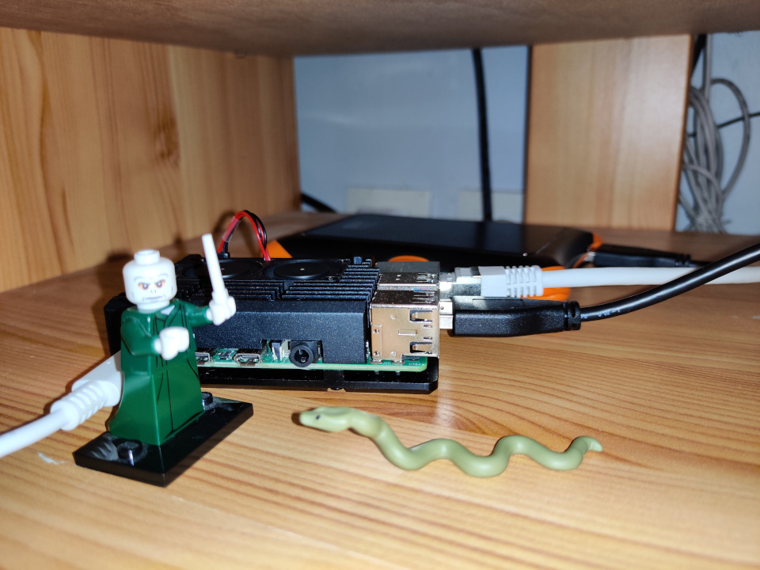

# Raspberry Pi 4 setup for a personal local cloud

I don't like GAFAM's way of eating my personal data.
So I decided to self-host my personal cloud to protect my privacy
and have full powers on my data instead of Google.

This page describes a basic Raspberry Pi installation:

- Hardware setup: personal data center based on a Raspberry Pi 4 and an SSD
- Software setup: configurable and semi-automated setup script from a regular
  Linux PC
    - preparation and installation of a RaspiOS image
    - configuration of the OS
    - remote access configuration (ssh)
    - basic software installation and network configuration (shell, git, tmux,
      fail2ban, dynamic DNS, SSL certificate, ...)
    - CalDav/CardDav server (Radicale)
    - torrent downloader (qBittorrent)
    - Web server (Apache)
    - Cloud services to replace evil Google services (Nextcloud)
    - UPnp media server

All being run on a small pretty Raspberry Pi ;-)

# Hardware setup

The server will run 24/7 so running on a regular desktop PC is no good idea.
We are going to install it on a Rapsberry Pi connected to the local network.

For this you will need:

- a Raspberry Pi (ideally a Raspberry Pi 4 with at least 4 Gb or RAM)
- an external USB HD or SSD to avoid SD card issues
- a Raspberry Pi power supply
- an Ethernet cable if you don't want to use the Raspberry Pi WiFi connection.

My own data center is also equipped with a nice aluminium open case with two
fans:



Just plug everything and let's continue with the software setup.

# Software setup

The software setup is completely made from a Linux PC connected to the same
local network than the Raspberry Pi (Ethernet or WiFi).

The whole installation is scripted. My script is available here:
[rrpi](rrpi).

`rrpi` connects to the Raspberry Pi with ssh. The Raspberry Pi
hostname shall be given on the command line. The default host name is
`raspberrypi.local`.
The script shows a menu for a step-by-step installation.

**WARNING**: This script is provided for free and with no guaranty. Please read
it before using it. It may fail and you may have to fix issues that are not
described here.


## Installation of RaspiIO on the external SSD.

### RaspiOS image download and configuration

1. Run `rrpi` and select `Prepare`.
2. Wait for RaspiOS being downloaded (it is saved to `~/raspios`).
3. An admin password may be asked to mount and configure the image.
4. Enter your WiFi SSID (leave it empty if you want to connect the Raspberry Pi
   to an Ethernet network).
    a. Enter your WiFi password.
    b. Enter your WiFi country (a two-letter country code).

### Installation to the external SSD

1. Run `rrpi` and select `Flash`.
2. Plug the SSD to the Linux PC (`rrpi` should auto-detect it).
3. Check the partition has been correctly detected and confirm (be sure the
   detected partition is actually the SSD or you may overwrite important data).
4. Wait for the image to be completely written to the SSD.
5. Unplug the SSD from the Linux PC and plug it to the Raspberry Pi.

## First configuration of RaspiOS

We will start by configuring the Raspberry Pi with `raspi-config`.

1. Run `rrpi` and select `Configure`
2. In the Raspberry Pi Configuration Tool some parameters can be changed:
    a. System Options / Password: change the `pi` user password and choose a strong password.
    b. System Options / Hostname: choose a different hostname (this hostname will be a parameter of `rrpi` in the next steps, e.g. `mypi`).
    c. Interface Options / SSH: Enable SSH.
    d. Localisation Options / Locale.
    e. Localisation Options / Timezone.
    f. Advanced Options / Network Interface Names: Enable predictable network i/f names.

## SSH configuration

To connect with SSH keys instead of password, you need to push your keys to the Raspberry Pi.

1. Run `ssh-keygen` to create your SSH keys if you don't have one.
2. Run `rrpi` and select `Keys` to push your public key to the Raspberry Pi.
3. Select `Ssh` to try your SSH configuration. You should now be connected to the Raspberry Pi.
4. Run `sudo reboot` to reboot with the new configuration (hostname, ...).

From now on you shall start `rrpi` with the right hostname (e.g. `rrpi mypi.local`).

## Installation/configuration of some basic packages

The following steps use a configuration files that must be created on the
Linux PC used to configure the Raspberry Pi:

- `~/.myconf`

This file is a Lua script that shall be executable and define the following parameters:

``` lua
-------------------------------------------------------------------------------
-- GANDI API
-------------------------------------------------------------------------------

gandi = {
    api_key = "Your Gandi API key here",
    domain = "your domaine name",
    subdomain = "subdomain pointing to the Raspberry Pi (e.g. mypi)",
    ipversion = 4 or 6,
}

-------------------------------------------------------------------------------
-- Network monitor
-------------------------------------------------------------------------------

netmon = {
    router = "local IP of the local router (may be your ISP modem or a local router)",
    box    = "local IP of your ISP modem",
    web    = {
        "first Internet server to ping",
        "second Internet server to ping",
        "third Internet server to ping",
    },
}

-------------------------------------------------------------------------------
-- AbuseIPDB
-------------------------------------------------------------------------------

abuseipdb = {
    api_key = {
        ssh = "Key used to report SSH attacks",
        web = "Key used to report Apache attacks",
    }
}
```

### Dynamic DNS configuration (`gdns`)

If the server shall be accessed from Internet, it shall have a fixed IP or a domain named.
`rrpi` can configure a DNS entry on a [Gandi](https://gandi.net) DNS record.
You will need to buy a domain name at Gandi (or adapt the script for your own needs) and create a configuration table with Gandi API key (`~/.myconf`).

The script `bin/gdns` will be created on the Raspberry Pi. It regularly checks
the external IP and updates the Gandi DNS record when the external IP changes.

### Network monitoring scripts (`netmon`)

`rrpi` creates two scripts used to monitor the Internet connectivity and the Raspberry Pi:

1. `~/bin/status`: updates `/var/www/html/status.html` (some statistics about the Raspberry Pi).
2. `~/bin/netmon`: updates `/var/www/html/netmon.html` (regularly pings some servers to check Internet is reachable).
   To reset this file, please delete `/var/www/html/netmon.csv`.

`netmon` is configured by `~/..myconf`.

My ISP modem is very bad and regularly looses Internet connection.
A simple workaround is to reboot the modem every night at 4 AM.
`netmon` ignores errors around 4 AM.
This behaviour can be changed in `rrpi`.

### Fail2ban

[Fail2ban](https://fail2ban.org) is used to ban IP that try to hack the
Raspberry Pi. Its configuration is hard-coded in `rrpi`. Banned IPs are
reported to [AbuseIPDB](https://www.abuseipdb.com/). AbuseIPDB keys shall be
defined in `~/.myconf`.

### Configuration

1. Run `rrpi mypi.local` and select `Install`.

   This will install some Debian packages:

   - fail2ban
   - fd-find
   - mc
   - neofetch
   - neovim
   - ripgrep
   - sshfs
   - tmux
   - ...

   and configure:

   - the shell (aliases, ...)
   - tmux
   - the firewall
   - fail2ban
   - gdns
   - netmon
   - status

## Installation of CDSoft programs

[hey](https://cdelord.fr/hey) is used to install some
[LuaX](https://cdelord.fr/luax) based softwares.

1. Run `rrpi mypi.local` and select `CDSoft`.

   This will install some CDSoft programs precompiled for Raspberry Pi:

   - [LuaX](https://cdelord.fr/luax)
   - [bang](https://cdelord.fr/bang)
   - [calculadoira](https://cdelord.fr/calculadoira)
   - [lsvg](https://cdelord.fr/lsvg)
   - [panda](https://cdelord.fr/panda)
   - [tagref](https://github.com/CDSoft/tagref)
   - [ypp](https://cdelord.fr/ypp)

   and also some great tools:

   - [pandoc](https://pandoc.org/)
   - [typst](https://typst.app/)
   - [PlantUML](https://plantuml.com/)
   - [ditaa](https://github.com/stathissideris/ditaa)

## Apache web server

The Apache web server can be used to host an HTTP server on the Raspberry Pi.
It is also required if you plan to install Nextcloud.

1. Run `rrpi mypi.local` and select `Apache`.
2. Select `Ssh` to connect to the Raspberry Pi.
3. Run `sudo certbot --apache` to configure and install SSL certificates.

## Radicale

[Radicale](https://radicale.org/v3.html) is a small but powerful CalDAV
(calendars, to-do lists) and CardDAV (contacts) server.
You can install Radicale if you don't need Nextcloud.

1. Run `rrpi mypi.local` and select `Radicale`.
2. Choose Radicale user name and password.

## Nextcloud

[Nextcloud](https://nextcloud.com/) is a complete alternative to Google
(calendars, contacts, drive, ...) and Dropbox (file synchronization). It works
pretty well and integrates perfectly with Thunderbird, Android, ... I have a
500 Gb cloud for just the price of a 500 Gb SSD and my data remain mine.

1. Run `rrpi mypi.local` and select `Nextcloud`.
2. Enter the MySQL password.
3. Some parameters must be applied manually to
   `/var/www/html/nextcloud/config/config.php` (see `rrpi` output).
4. Connect to `http:mypi.local/nextcloud` to configure the Nextcloud server.

## UPnP

The Debian packet `minidlna` can be used to store and shared media files
(music, video, ...). Shared files will be stored in `/home/pi/dlna`.

1. Run `rrpi mypi.local` and select `UPnP`.

## qBittorrent

1. Run `rrpi mypi.local` and select `qBittorrent`.
2. Run `qbittorrent-nox` on the Raspberry Pi to start the qBittorrent server
   (`Ctrl-C` to stop it).

# WORK IN PROGRESS...

This script is constantly updated and the documentation may be outdated.
The best is always to read the sources and change them to fit your requirements.

# Git server

GitHub and GitLab are great but if you need private repositories,
you may want better privacy and control over your data.

And Git can be installed locally on a Raspberry Pi.

## Git installation

The procedure described here is a summary of
[Build your own Raspberry Pi Git Server](https://pimylifeup.com/raspberry-pi-git-server/).

1. Connect to the Raspberry Pi

    ``` sh
    ssh pi@pi
    ```

2. Ensure git is installed

    ``` sh
    sudo apt update
    sudo apt upgrade
    sudo apt install git
    ```

## Create a repository on the Raspberry Pi

1. Create a directory

    ``` sh
    mkdir -p /home/pi/git/hello
    cd /home/pi/git/hello
    ```

2. Initialize the Git repository

    ``` sh
    git init --bare
    ```

## Create the repository on your PC

1. Create the repository

    ``` sh
    git init
    git remote add hello pi@git.example.com:/home/pi/git/hello
    ```

3. Push the first commit

    ``` sh
    git add .
    git commit -m "Initial commit"
    git push hello master
    ```

4. Clone the repository on another PC

    ``` sh
    git clone pi@git.example.com:/home/pi/git/hello
    ```

